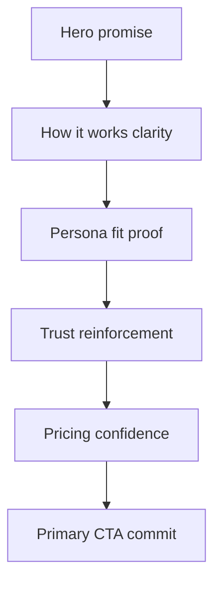

# Exhaustive Landing Page Audit for [`index.html`](index.html)

## Executive Summary
- The page is visually coherent and premium-leaning, but performance risk is concentrated in repeated hover effects and blur/shadow usage, especially on low/mid devices.
- The UX structure is strong in sequence, but the page currently over-indexes on similar card patterns, creating visual sameness and reduced scanning energy.
- Marketing flow is decent pre-paywall, yet trust proof is underdeveloped and CTA strategy is fragmented across too many equal-priority buttons.
- Highest leverage: reduce render cost of blur/shadows/transitions, sharpen hierarchy, compress section cadence, and upgrade trust architecture above pricing.

---

## 1) Performance and Resource Optimization Audit

### A. High-cost rendering patterns identified

1. **Global runtime Tailwind CDN in production**
   - Found in [`<script src="https://cdn.tailwindcss.com">`](index.html:7).
   - Impact: runtime style generation + larger style scope + inconsistent FCP/LCP behavior vs precompiled CSS.

2. **Backdrop blur on fixed header**
   - Found at [`backdrop-blur-md`](index.html:10).
   - Impact: fixed elements with backdrop filtering force expensive compositing during scroll.

3. **Backdrop blur + large glow on hero preview container**
   - Found in [`backdrop-blur-sm`](index.html:26) and custom shadow [`shadow-[0_0_50px_rgba(0,255,255,0.1)]`](index.html:26).
   - Impact: blur + large-area glow over large element magnifies paint/composite cost while scrolling.

4. **Repeated `transition-all` on interactive components**
   - Found across CTA and cards, e.g. [`transition-all duration-300`](index.html:13), [`transition-all duration-300`](index.html:24), [`transition-all duration-300`](index.html:43), [`transition-all duration-300`](index.html:71).
   - Impact: transitions can unintentionally animate expensive properties (shadow, border-color, background), increasing jank risk.

5. **Many hover shadow effects across grids**
   - Found in multiple cards with [`hover:shadow-lg hover:shadow-cyan-500/10`](index.html:43), [`hover:shadow-lg hover:shadow-cyan-500/10`](index.html:71), and annual pricing glow [`shadow-[0_0_35px_rgba(168,85,247,0.2)]`](index.html:142).
   - Impact: multiple box-shadows over dark translucent surfaces can increase paint pressure.

6. **Full-page radial gradient background**
   - Found in [`bg-[radial-gradient(circle_at_20%_0%,#0a0a1a_0%,#000_50%,#000_100%)]`](index.html:9).
   - Impact: acceptable generally, but combined with transparency/blur stack contributes to layered compositing cost.

### B. Layout thrash and scroll smoothness findings
- No JS-driven layout loop detected in current page structure.
- Main issue is **paint/composite pressure**, not DOM complexity (DOM size is moderate).
- Scroll choppiness likely from: fixed blurred header + translucent/blurred hero module + repeated heavy hover style declarations.

### C. Lightweight alternatives preserving premium glassmorphism

1. **Header glass fallback strategy**
   - Replace heavy blur-first approach in [`header`](index.html:10) with:
     - solid/translucent dark background by default,
     - optional subtle blur only behind `@supports` and only at low radius.

2. **Glow without heavy large blur shadows**
   - For hero preview in [`index.html:26`](index.html:26):
     - reduce shadow radius/intensity,
     - move glow to pseudo-layer gradient border effect,
     - avoid large spread shadows on large containers.

3. **Replace `transition-all` with property-scoped transitions**
   - For links/buttons/cards at [`index.html:13`](index.html:13), [`index.html:24`](index.html:24), [`index.html:43`](index.html:43), [`index.html:71`](index.html:71):
     - transition only transform and opacity (and maybe color), not all properties.

4. **Prefer transform/opacity for interaction feedback**
   - Keep tiny lift effects (`translateY`) but avoid shadow animation as primary motion.
   - Use static low-cost border tint changes for hover rather than animated blur-like glow.

5. **Introduce reduced motion safety**
   - Add a `prefers-reduced-motion` rule for animated transitions and hover lifts.

6. **Production CSS delivery**
   - Replace Tailwind CDN usage at [`index.html:7`](index.html:7) with compiled CSS artifact and purge unused classes.

---

## 2) UI/UX and Page Aesthetics Audit

### A. Strong components to keep/enhance
- **Hero headline gradient execution is strong** in [`h1`](index.html:21): premium tone and clear central promise.
- **Section ordering** (Hero → How it Works → Personas → Roadmap → Pricing) is strategically sound.
- **Card rhythm and corner radius system** is consistent and modern.
- **Dark theme with cyan-purple accents** aligns with AI-product expectations.

### B. Weaknesses and design debt

1. **Visual monotony from repeated card style language**
   - Many sections reuse near-identical card treatment, reducing novelty and scannability.

2. **Whitespace cadence is generous but repetitive**
   - Repeated large vertical padding (`py-24 sm:py-28`) at [`index.html:36`](index.html:36), [`index.html:62`](index.html:62), [`index.html:91`](index.html:91), [`index.html:118`](index.html:118) creates long-scroll fatigue.

3. **Typographic hierarchy needs stronger contrast in section intros**
   - Subheads and body lines often sit too close in visual weight.
   - Supporting text could tighten line length in some sections for faster scan.

4. **Hero preview block is under-informative**
   - Placeholder [`APP INTERFACE PREVIEW`](index.html:27) does not reinforce credibility/value; currently reads as unfinished.

5. **Mobile experience concerns**
   - Large paddings and many stacked cards create high scroll depth before pricing.
   - Multiple equally weighted CTAs on small screens may create decision friction.

### C. Color psychology review
- Cyan/purple palette communicates “advanced AI + premium”.
- Overuse of cyan accents (labels, borders, hover glows, CTAs) reduces attentional hierarchy.
- Recommendation: reserve cyan for primary actions and key emphasis, use muted neutral accents for secondary elements.

---

## 3) Marketing Copy, Value Proposition, and Trust Signals Audit

### A. Value Prop Sandwich evaluation
Flow assessed across:
- Hero promise [`Master the art of the reply`](index.html:21)
- Process education [`How it Works`](index.html:39)
- Persona differentiation [`Meet Your AI Strategists`](index.html:65)
- Future confidence [`Product Roadmap`](index.html:94)

**What works**
- Narrative is coherent and progressive.
- “15 Free Generations” in hero ([`index.html:23`](index.html:23)) lowers immediate friction.

**What underperforms**
- Hero lacks concrete outcome metrics and specific proof points.
- “How it Works” copy is clear but generic; needs sharper objection-handling.
- Personas are compelling conceptually but not tied to measurable user outcomes.
- Roadmap is good for vision but could weaken urgency if not framed as current value first.

### B. CTA strategy audit
Current CTA surfaces include:
- Header [`Get Started`](index.html:13)
- Hero [`Try for Free`](index.html:24)
- Pricing cards [`Get Started Free`](index.html:131), [`Choose Monthly`](index.html:139), [`Choose Annual`](index.html:149)

Findings:
- CTA count is acceptable, but hierarchy is diluted by multiple equal-intent labels.
- Header CTA and hero CTA should be message-consistent.
- Pricing CTAs are clear, but pre-pricing sections miss one contextual CTA after trust buildup.

### C. Trust signal audit
Current trust cues:
- Footer text [`Encrypted by Supabase • Powered by Claude 3.5`](index.html:161)
- Stripe badge graphic [`stripe-verified-badge.svg`](assets/stripe-verified-badge.svg)

Findings:
- Trust proof is too weak and too low on page.
- “Text-only trust” appears unsubstantiated.
- No testimonials, user count, logos, case micro-proofs, ratings, security specifics, or guarantee framing near conversion areas.

High-impact trust additions:
- Add compact social proof bar above fold with quantified proof.
- Add real testimonial cards with persona-specific outcomes.
- Add security and billing reassurance near pricing CTAs.
- Add friction-reduction microcopy near primary CTA.

---

## 4) Prioritized Action Plan for Exact `index.html` Changes

## P0 — Critical: Fix scroll performance and rendering cost
- Replace Tailwind CDN dependency in [`index.html:7`](index.html:7) with production-compiled CSS include.
- Refactor header style in [`index.html:10`](index.html:10): reduce or conditionally apply blur, strengthen opaque fallback.
- Refactor hero preview container in [`index.html:26`](index.html:26): remove/reduce backdrop blur + heavy 50px glow.
- Replace every `transition-all` usage in interactive elements (examples at [`index.html:13`](index.html:13), [`index.html:24`](index.html:24), [`index.html:43`](index.html:43), [`index.html:71`](index.html:71)) with targeted transitions.
- Tone down animated shadow reliance on cards and buttons; keep lightweight transform + border color feedback.
- Add reduced-motion support for all hover/transitions.

## P1 — High: Improve hierarchy, readability, and conversion flow
- Tighten vertical spacing rhythm by reducing repeated section padding at [`index.html:36`](index.html:36), [`index.html:62`](index.html:62), [`index.html:91`](index.html:91), [`index.html:118`](index.html:118).
- Upgrade hero supporting text with concrete outcomes and confidence-building specificity.
- Replace placeholder hero preview content at [`index.html:27`](index.html:27) with a real product screenshot or interactive mock and short caption.
- Differentiate section visual patterns so each block has a unique scan signature.
- Normalize CTA language into one primary phrase family for consistency.

## P2 — High: Strengthen trust and market credibility
- Add a real social proof strip near hero with logos, stats, or adoption signal.
- Add testimonials/outcome snippets between personas and roadmap or before pricing.
- Add security/payment reassurance module above pricing and near CTA buttons.
- Expand credibility statements currently in footer [`index.html:161`](index.html:161) into auditable trust modules with evidence.

## P3 — Medium: Improve mobile pacing and cognitive load
- Reduce stacked card fatigue on mobile by shortening copy blocks and tightening spacing.
- Insert mid-page CTA after “How it Works” or Personas to capture intent before roadmap/pricing.
- Improve mobile-first scanning by increasing contrast between headings/subheads/body and reducing decorative repetition.

---

## Conversion Funnel Snapshot

---

## Final Audit Verdict
- Foundation is strong and directionally correct.
- Current page is not yet immaculate due to render-cost hotspots, repetitive visual rhythm, and underpowered trust architecture.
- Executing the P0/P1/P2 set above will materially improve scroll smoothness, perceived premium quality, and conversion readiness while preserving the brand’s glassmorphism aesthetic.